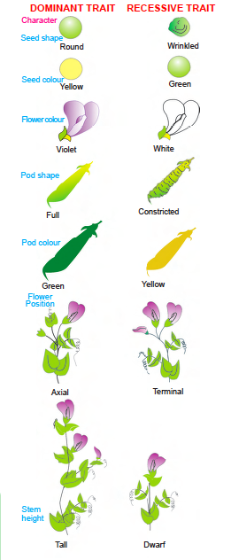

#Heridity and Evolution
## HEREDITY AND VARIATION

&nbsp;&nbsp;&nbsp;&nbsp;&nbsp;&nbsp;&nbsp;&nbsp;
A cow gives birth to a calf, a cat to a kitten and so forth. However, on close observation of a cow and its calf or a cat and its kitten, we see a number of differences such as the colour of the skin, size etc. So the conclusion to be derived is that, the offspring, by virtue of being the progeny, need not be an exact replica of its parents.

&nbsp;&nbsp;&nbsp;&nbsp;&nbsp;&nbsp;&nbsp;&nbsp;
Inheritable characteristics of the parents are passed on from one generation to the next through genes. No two individuals, even biologically related individuals, are alike in every way and the differences variation. Living organisms show a great deal of variation.

### HEREDITY

&nbsp;&nbsp;&nbsp;&nbsp;&nbsp;&nbsp;&nbsp;&nbsp;
The rules of heredity determine the process by which the traits and the characteristics are relatively inherited. 

&nbsp;&nbsp;&nbsp;&nbsp;&nbsp;&nbsp;&nbsp;&nbsp;
“The inheritance of characteristics from one generation to another generation is called heredity.”

&nbsp;&nbsp;&nbsp;&nbsp;&nbsp;&nbsp;&nbsp;&nbsp;
The inheritable characteristics (traits) may be morphological / anatomical / physiological / reproductive.

&nbsp;&nbsp;&nbsp;&nbsp;&nbsp;&nbsp;&nbsp;&nbsp;
If we take a very close look at the rules of inheritance, both father and mother contribute an equal amount of genetic material to the child. This by both paternal and maternal genetic material – i.e. DNA.
Gregor Johann Mendel (1822-1884) experimental study on heredity.

&nbsp;&nbsp;&nbsp;&nbsp;&nbsp;&nbsp;&nbsp;&nbsp;
Mendel, an Austrian Augustinian monk, observed variations in the characteristics of garden pea plant (Pisum sativum) which, he had cultivated in his monastery garden. of crossing of pea plants with variation in traits.

&nbsp;&nbsp;&nbsp;&nbsp;&nbsp;&nbsp;&nbsp;&nbsp;
The visible contrasting characteristics that Mendel focussed on the garden pea plants were:

|                 |   |                     |
|:---------------:|:-:|:-------------------:|
|    Seed shape   | - |   Round / Wrinkled  |
|   Seed colour   | - |    Yellow / Green   |
|  Flower colour  | - |    Violet / White   |
|    Pod shape    | - |  Full / Constricted |
|    Pod colour   | - |    Green / Yellow   |
| Flower position | - | Axillary / Terminal |
|   Stem height   | - |     Tall / Dwarf    |

<div 
```{r ,fig.align='center',fig.cap="Seven pairs of contrasting traits in Pea plant studied by Mendel.",echo=FALSE}

```


#### Mendel’s Monohybrid Cross
&nbsp;&nbsp;&nbsp;&nbsp;&nbsp;&nbsp;&nbsp;&nbsp;
Mendel selected tall and dwarf garden pea plants, Pisum sativum, for his experiments. Mendel selected tall and dwarf pea plants for his experiments. He observed their growth for nearly two years and found that tall plants always produce tall plants and dwarf plants produce dwarf plants - generation after generation, on self pollination and under natural conditions. He termed those tall and dwarf plants as “wild types” or “pure breeding” varieties.

&nbsp;&nbsp;&nbsp;&nbsp;&nbsp;&nbsp;&nbsp;&nbsp;
He crossed a tall plant with a dwarf plant, and observed how the traits are transmitted the progeny and calculated the